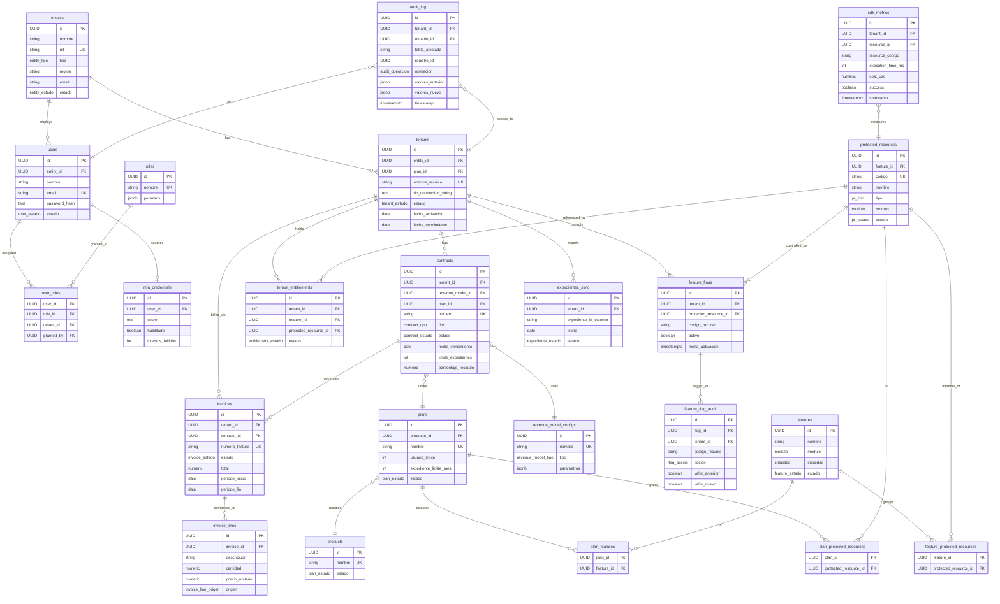

# JikkoOps Control Database — Entity Relationship Diagram



## Architecture Note: Central DB vs Tenant DBs

This diagram represents the **central JikkoOps control database**. It stores commercial, billing, and access-control data only.

Each tenant also has its own **isolated operational database** (connection string stored encrypted in `tenants.db_connection_string`) that holds the tenant's domain data (expedients, liquidations, documents, etc.). That schema is managed by SILIN/DOS/SOCIA and is **not** represented here.

```
JikkoOps Central DB (this repo)
├── Commercial: entities, tenants, contracts, plans, products
├── Access Control: feature_flags, protected_resources, entitlements
├── Billing: invoices, invoice_lines, revenue_model_configs
├── Auth: users, roles, mfa_credentials
└── Audit: audit_log, sdk_metrics, expedientes_sync

Tenant Operational DB (per tenant, separate)
├── Expedientes (domain data)
├── Liquidaciones
├── Documentos
└── Ciudadanos
```
