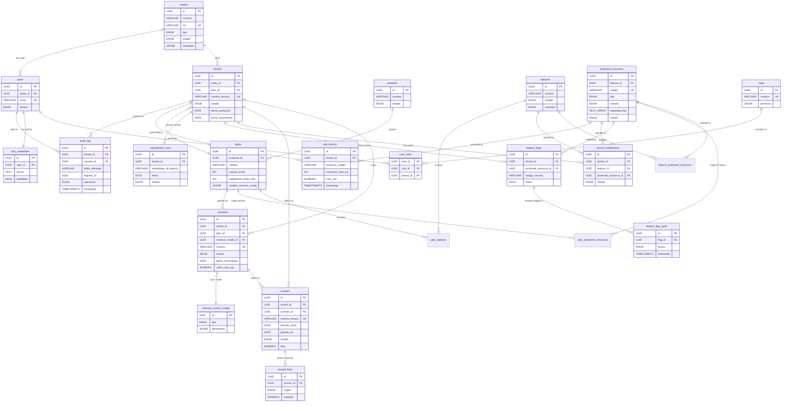

# JikkoOps Control Database - Entity Relationship Diagram

> **Status**: v0.1 — First approach. Will evolve with product/CEO specs.

## Mermaid ERD

## Relationship Summary

| From | Cardinality | To | Purpose |
|------|-------------|-----|---------|
| entities | 1..N | tenants | One entity, multiple JikkoOps instances |
| tenants | N..1 | plans | Each tenant subscribed to one plan at a time |
| tenants | 1..N | contracts | A tenant signs multiple contracts over time |
| tenants | 1..N | invoices | Billing per service period |
| tenants | 1..N | feature_flags | One flag per protected resource per tenant |
| plans | 1..N | plan_features | Plan grants access to multiple features |
| features | 1..N | protected_resources | A feature bundles many resources |
| protected_resources | 1..N | feature_flags | A resource has one flag per tenant |
| contracts | 1..N | invoices | A contract is billed across periods |
| contracts | N..1 | revenue_model_configs | Each contract uses one revenue model |
| feature_flags | 1..N | feature_flag_audit | Every change recorded |
| users | 1..N | user_roles | RBAC assignment with optional tenant scope |
| users | 1..1 | mfa_credentials | One MFA setup per user |

## Key Design Choices

1. **DB-per-tenant for operational data** — this control database holds only tenant configuration, contracts, billing. Tenant-specific operational records live in separate per-tenant databases.
2. **Feature flags denormalize `codigo_recurso`** — avoids a JOIN in the hot path.
3. **Audit log is insert-only** — UPDATE/DELETE prohibited at app layer + RLS hint provided.
4. **Junction tables (`*_features`, `*_protected_resources`)** instead of UUID arrays — easier to index, query, and join.
5. **Revenue models as reusable configs** — contracts reference a `revenue_model_config` instead of embedding logic.
6. **Encryption noted in column comments** — `db_connection_string`, `mfa_credentials.secret`, `mfa_credentials.backup_codes` MUST be encrypted at rest by the application layer.

## Scaling Hooks

- `audit_log`, `sdk_metrics`, `expedientes_sync` are designed for monthly partitioning when row counts demand it (hints in comments).
- `feature_flags` covers index `(tenant_id, protected_resource_id, activo)` keeps the runtime check < 1ms even at 100k+ tenants.
- Indexes on `fecha_vencimiento` are filtered (`WHERE estado = 'activo'`) to minimize index size.
